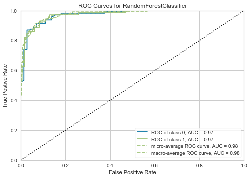

# Baseball_Classification 

## Contributors
Sean Carver

Emefa Agodo

## Introduction
Baseball is described more accurately with the Markov chain model due to conditional probability distribution. The future states of the baseball depend upon the present state and not the sequence of events that preceded it. Based on modeling assumptions, the Markov chain can predict which teams score in the top third without classification.

Project Goal: Predict which baseball teams score in the top third using machine learning.

## DataSet

The Markov chain describes baseball with 313 nonzero parameters. Our features, derived for each team from play-by-play data taken from the 2011 MLB season. From this data, a transition matrix was created to show the probabilities of each play. Using this matrix, 1000 fantasy teams were created by randomly selecting transition probabilities with same mean and covariance. A season was simulated to label the top scorers. We labeled the teams above the 66.667 percentile for scoring, and predicted the label for test teams.

## Results
Four classifcation models were used: Support Vector Machine, K-Nearest Neighbors, Random Forest and Decision Tree. Out of the models used, the Random Forest Model performed the best. The initial accuracy and F1 score of the Random Forest model was 0.84 and 0.77 but was fine tuned with a Randomized Search Cross-Validation model and improved the accuracy and F1 score to 0.92 and 0.84.

The ROC curve for the Random Forest Model, which is very close to one in the upper left hand corner, shows that it was very efficient in determining which teams were in the top third and which teams were not.

## Conclusion
Due to the complexity of the fatansty team matrix, further analysis needs to be completed. Our recommedations for further analysis are:

1. Recreate another fantasy matrix to see if the Randomized Search which was used to tune the Random Forest model can reproduce the same or similar results.
2. Explore other classification ideas such as American vs National league, pitch hand, offensive vs defensive plays, player analysis, and pitch sequence.

## Source
https://github.com/maxtoki/baseball_R

## Summary of files

Baseball_2011_test_modeling.ipynb - notebook exploring machine learning models using base data
 
Baseball_2011_exploration.ipynb - notebook exploring the 2011 MLB play by play stats

Baseball Classification.pdf - contains power point presentation of project

Markov folder - contains the notebooks of transition probabilities and fantasy teams

Data/processed folder contains: 

Baseball_Fantasy_Team_Classification.ipynb - final notebook of project

Fantasy_Teams_Modeling.ipynb - notebook exploring machine learning models using fantasy teams

contains images used for final notebook

Xy.pkl - pickle file of 1000 fantasy team observations

data2011.pkl - pickle file of transition probabilites
